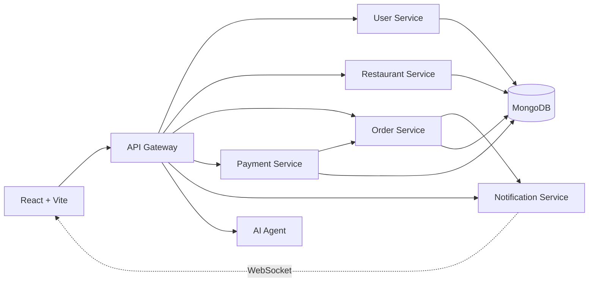

# CampusCrave

CampusCrave is a full-stack campus food ordering platform built around a production-minded microservice architecture. Customers can discover restaurants, create an order, complete a retry-safe payment, and follow authenticated status updates in real time. Restaurant administrators manage their own menus and advance orders through a controlled workflow.


## Why this project stands out

- Six independently deployable backend services behind one API gateway
- Authenticated WebSocket updates with reconnect and backoff behavior
- Server-authoritative menu pricing to prevent client-side price tampering
- Idempotent payments and database constraints that prevent duplicate charges
- Explicit order state transitions with a complete status audit trail
- Role-based access control, Zod validation, security headers, and rate limiting
- Health and readiness checks for every deployed service
- 128 automated API and unit tests, plus a deployment-blocking CI workflow
- Responsive React interface with smart order drafting and an AI assistant
- Installable PWA with offline shell support and mobile safe-area navigation

## Architecture



The gateway is the browser's only backend entry point. It verifies sessions, applies request limits, forwards HTTP traffic, and proxies WebSocket upgrades. Internal service mutations require a separate shared token.

## Product flow

1. Create an account or sign in.
2. Search restaurants by name or cuisine.
3. Select menu items or describe an order with Smart Order.
4. Review the server-calculated total and place the order.
5. Complete the simulated payment. Retries reuse an idempotency key.
6. Follow live status updates and review the order timeline.

Restaurant administrators have a separate dashboard for restaurant, menu, and order management.

## Technology

| Area | Stack |
| --- | --- |
| Frontend | React 19, Vite, Redux Toolkit, Tailwind CSS |
| API | Node.js, Express, API Gateway pattern |
| Data | MongoDB, Mongoose |
| Real time | WebSockets |
| AI | FastAPI, LangChain, LangGraph, OpenRouter/OpenAI-compatible API |
| Quality | Jest, Supertest, ESLint, GitHub Actions |
| Delivery | Docker, Docker Compose, Nginx, Docker Hub |

## Local development

### Requirements

- Node.js 20+
- Python 3.12+
- MongoDB connection string

### Setup

```bash
git clone https://github.com/viswasuryakumar/food_platform.git
cd food_platform
copy .env.example .env
npm run setup
npm run dev
```

On macOS or Linux, use `cp .env.example .env` instead of `copy`.

The application runs at:

- Frontend: `http://localhost:5173`
- API gateway: `http://localhost:3000`
- Gateway health: `http://localhost:3000/health`
- Dependency readiness: `http://localhost:3000/health/services`

## Environment

Copy `.env.example` to `.env` and set `MONGO_URI`. The setup script generates strong values for blank `JWT_SECRET` and `INTERNAL_SERVICE_TOKEN` fields and writes the service-specific environment files.

To enable the AI assistant, set `OPENROUTER_API_KEY` and optionally change `OPENROUTER_MODEL`. The rest of the ordering flow works without an AI key.

Never commit `.env` files or real credentials.

## Testing

```bash
npm test
cd frontend
npm run lint
npm run build
```

The root test command runs all five Node service suites. CI runs those suites independently, lints and builds the frontend, and smoke-tests the gateway before deployment is allowed.

## Deployment

The repository includes production Docker images and a GitHub Actions workflow for a Docker Compose host.

Required GitHub Actions secrets:

| Secret | Purpose |
| --- | --- |
| `DOCKER_USERNAME` | Docker Hub namespace |
| `DOCKER_TOKEN` | Docker Hub access token |
| `VITE_API_URL` | Public HTTPS URL of the API gateway |
| `DROPLET_HOST` | Deployment server hostname or IP |
| `DROPLET_USER` | SSH user |
| `DROPLET_SSH_KEY` | Private deployment key |

The server also needs a root `.env` containing `DOCKER_USERNAME` and service `.env` files generated from production values. A push to `main` runs CI, publishes only changed images, then updates the Compose deployment.

For a public portfolio deployment, place a TLS reverse proxy in front of ports `5173` and `3000`, use a dedicated least-privilege MongoDB user, restrict inbound service ports, and configure `CORS_ORIGIN` to the exact frontend URL.

## Team

Team 4 — Mitochondria

- Viswa Surya Kumar Suvvada
- Girith Choudary
- Anil Kumar Bandaru
- Harsha Vardhan Badithaboina
- Sanjushree Golla

## License

This repository currently uses the ISC license declared in `package.json`.
